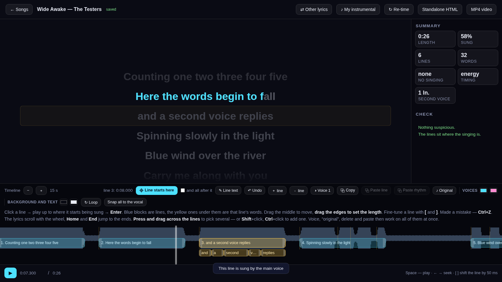
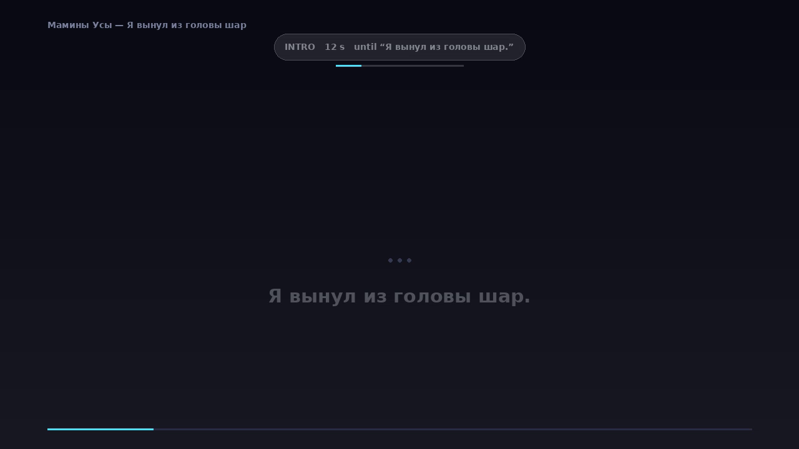

# Karaoke Studio

[](https://github.com/frdm666/free-karaoke-editor/actions/workflows/tests.yml)

**A song + its lyrics → one offline HTML page.** The lyrics scroll, every word
lights up as it is sung, a slider brings the original voice back, and the whole
thing is a single file you can open by double-clicking — no internet, no
account, no subscription.

*По-русски: [README.ru.md](README.ru.md)* · *what changed: [CHANGELOG.md](CHANGELOG.md)*



| | |
|---|---|
| **Timing** | word-by-word, by Whisper (`stable-ts`) — or instantly by loudness |
| **Instrumental** | separated with Demucs, or use the artist's own — the voice is then extracted per frequency band |
| **Editing** | a window where lines and single words are dragged into place; every change saves itself |
| **Two voices** | a lead and a backing part, their own colours, two lanes, simultaneous lines side by side |
| **Output** | one standalone HTML, an `.lrc`, or an MP4 for YouTube |
| **Languages** | interface in English and Russian, lyrics in 14 |

## Start in three steps

1. Install Python 3.8+ from <https://python.org> (on Windows tick
   **“Add Python to PATH”**).
2. Run **`Install.bat`** (Windows) or **`install.command`** (macOS) — it checks
   ffmpeg and installs the Python libraries.
3. Run **`Studio.bat`** / **`studio.command`**, drop a song and a lyrics file
   into the window, press **Build**.

From the command line, without the window:

```bash
python app/karaoke.py song.mp3 lyrics.txt
```

---

## What you need

* Python 3.8 or newer — <https://python.org>
  (on Windows tick **“Add Python to PATH”** during installation)
* ffmpeg — installed for you by `Install.bat` / `install.command`

Everything else the setup script offers to install: `stable-ts` for word-level
timing, `demucs` for the instrumental, `pillow` for the MP4 render.

No `.exe` bundle is shipped on purpose: the program should work on macOS the
same way it works on Windows, and the source has to stay readable — that is the
point of publishing it.

## First run

| Windows | macOS / Linux |
|---|---|
| `Install.bat` | `install.command` (or `python3 app/tools/setup_check.py`) |
| `Studio.bat` | `studio.command` (or `python3 app/studio.py`) |
| `Make-karaoke.bat` — drag a song and lyrics onto it | `make-karaoke.command` |
| `Make-video.bat` — drag a built page onto it | `python3 app/tools/video.py page.html` |

Songs live in `projects/`. The timing is saved to disk as you edit; nothing is
rebuilt.

## What is in the folder

```
Install.bat  install.command    set up (once)
Studio.bat   studio.command     open the program window
README.md    README.ru.md       this text (English / Russian)
CHANGELOG.md CHANGELOG.ru.md    what changed, newest first
projects/                       your songs
app/                            the program itself
```

Nothing else sits in the root. Inside `app/`: the code, `settings.example.ini`,
`START-HERE.txt`, the server notes, the tests, and `Make-karaoke.bat` /
`Make-video.bat` for people who like dragging files from the file manager.
Songs live in `projects/` and are left alone by updates — only the `app` folder
is replaced.

Song folders are named in Latin letters: “Мамины Усы” becomes `maminy-usy`, so
they open the same way on any system. The finished HTML and MP4 follow the same
rule.

## The lyrics file

One line of the song per line of the file. Blank lines are ignored.

```
title: Song name
artist: The Band

[Verse]
First line as it is sung
Second line
(and this is a backing vocal)
```

* `[Square brackets]` on their own line — a section heading, not sung.
* `(Round brackets)` — a **sung** line, the way backing vocals are usually
  written. It gets the second voice and its own colour. `(Chorus)` and other
  section names are recognised by their first word and stay headings.
* Punctuation on its own — a dash, an ellipsis — is kept and shown; it sticks to
  the neighbouring word.
* `[00:12.34] line` — a ready LRC timing. If the file has them, alignment is
  skipped.

### Who sings, and how many times

The voice can be set in the text itself:

```
The first voice sings an ordinary line
2: and the second one sings this
(backing vocals too — they are the second voice by default)

[voice 2]
From here the second voice sings everything,
this as well,
[voice 1]
and here the first one is back.
```

`2:` at the start of a line applies to that line only. `[voice 2]` switches
every following line until told otherwise.

Repeats are written at the end of a line:

```
Chorus x4
```

The program spreads it into four lines by itself. `x4`, `×4` and the Russian
`х4` all work, brackets are allowed — `(x4)` — and the number can be 2 to 99.
A section heading is not repeated with the line, and if the file has manual LRC
timings, repeats are left alone: every line there has its own time.

## The finished page

* Space — play/pause, `←` `→` — seek, `F` — full screen, `M` — voice on/off.
* **Voice** slider: 0 % — instrumental only, 100 % — the original.
* **Offset** slider — moves the whole text against the music.
* `RU` / `EN` button — the language of the labels, remembered per song.
* **Edit** — move a line to the current second, shift everything after it, tap
  the song through by pressing Space on every line, undo, save the page with
  your edits.

## Tune one line, reuse it

A chorus is sung the same way every time. **⧉ Rhythm** remembers the word
layout inside the selected line, **⧉ Paste rhythm** applies it to another line
with the same number of words — the line's start does not move, only the
pattern inside it. With “and all after it” the rhythm goes into every later
line with the same text; the button says how many were found. `Ctrl+D`
duplicates a line entirely, right below the original, and `Ctrl+Shift+V` puts
the copied line in place of the selected one.

Several lines at once: **press and drag across the lines** — the simplest way —
or **Shift**+click (Shift+arrows) for a run and **Ctrl**+click to add one.
Copying takes everything selected: a block of lines can be pasted elsewhere,
keeping the gaps between them. Voice, “original”, delete and paste then apply to the
whole batch.

## Two voices, colours and “the original sings this”

Vocals overlap: a lead and a backing, a clean voice and a scream. A line can be
given the **second voice** (`◑ Voice` in the Studio, or automatically when the
line is wholly in round brackets):

* in the Studio the timeline splits into **two lanes**, so the blocks stop
  covering each other;
* on the finished page such a line is highlighted in the **second colour**;
* lines that sound at the same time are highlighted **together**.

**`♪ Original`** marks a line you are not meant to sing — backing vocals,
speech, a bit that matters to the story. The original voice comes back exactly
there, whatever the Voice slider says, and fades out again at the end of the
stretch. In the MP4 the same stretch is mixed with the vocal.

Colours are the four swatches on the timeline: the first pair is the
highlight (main voice, second voice), the second is the page look (background
and text). Text that blends into its background is corrected automatically —
the hue stays yours, the lightness moves until the contrast is at least 4.5.

From the command line: `--colors "#4de1ff,#ff8ad1"`, `--theme "#0a0b14,#e8ebf5"`.

## Your own instrumental

If the artist released a real instrumental, put it in instead of the separated
one: **♪ My instrumental** in the Studio. The offset is measured by
cross-correlation (worst error in testing: 1.2 ms) and the timing follows it.

The voice is then extracted by subtraction — the original minus your
instrumental — **per frequency band**, not by one volume level. An official
instrumental is almost never mixed like the same arrangement inside the song:
different mastering, different EQ, different level. A single multiplier cannot
cancel that, and the leftovers sound like a second, foreign recording playing
next to the minus. Measured on a deliberately mismatched pair: 29 dB of
arrangement suppression against 17 dB for plain subtraction, with the voice
intact (27 dB signal-to-noise).

If the stretches without singing do not get at least 4 dB quieter, the
instrumental is treated as belonging to another recording and no voice is
extracted at all — only your instrumental plays.

## Before and after the long part

Before building, the program prints a report: length, stretches without
singing, lines and words, repeats, the language it detected, what it is about
to do and roughly how long that takes.

After building, the Studio shows a **Summary** on the right: length, how much
of the song is sung, lines and words, stretches without singing (clickable),
which engine did the timing, how many lines belong to the second voice and how
many are left to the original.

While nothing is being sung — an intro or a long instrumental — a strip at the
top of the stage counts down to the next line and names it. Gaps shorter than
five seconds are not counted down; they are obvious anyway.

## Command line

```
python app/karaoke.py AUDIO LYRICS [-o FILE.html]

timing
  --align {auto,whisper,energy,none}   alignment engine
  --whisper-model tiny|base|small|medium|large-v3
  --lang ru                            language of the lyrics
  --device cuda|cpu
  --timings timings.json               take ready timings (exported from the player)

audio
  --no-separate                        no instrumental (fast)
  --codec mp3|opus|aac                 mp3 — maximum compatibility

output
  --no-embed                           do not embed the audio, put files alongside
  --lrc                                also save an .lrc
  --title / --artist                   override the captions
  --colors "#4de1ff,#ff8ad1"           highlight colours: main voice, second voice
  --theme "#0a0b14,#e8ebf5"            page look: background and text
  --ui-lang auto|en|ru                 language of the labels on the page
```

`app/settings.ini` holds the same options for the launcher scripts, with English
key names (the Russian ones still work). That file is yours: it is not in the
repository, so an update never overwrites it. `Install.bat` /
`install.command` make it on the first run from `app/settings.example.ini`,
which is the documented reference — copy it by hand if you prefer. Without any
settings file the program simply uses its defaults.

## Language

The finished page and the Studio window are bilingual, English and Russian,
with a switch in each. The program's own messages follow `ui-lang` in
`settings.ini`, then the system language. Language *names* in the picker are
written in their own language and are never translated.

## Adding a language

The window and the finished page speak English and Russian. Another language is
a JSON file — no code, no rebuild:

1. Copy `app/kstudio/messages/template.json` to `<code>.json` (`de.json`,
   `uk.json`, `pl.json`…).
2. Translate the values. An empty value falls back to English, so a
   half-finished file is already useful.
3. Reload the window: the language button cycles through everything it finds.

Pull requests with translations are welcome — that is the easiest way to help.

## Video for YouTube



```bash
python app/tools/video.py page.html -o clip.mp4
```

1920×1080 by default, `--audio minus|guide|original`, `--seconds N` to render a
short sample first. Before drawing, the video prints its own report — song,
length, lines, where two voices sing at once, stretches left to the original,
colours, audio mode, number of frames — so a wrong file or forgotten marks show
up before the long part, not after it.

During the intro and long instrumental stretches the video shows a countdown at
the top — how long until the next line, which line it is, and a bar filling to
its start. Gaps shorter than five seconds are not counted down.

The video takes the colours and the look from the page: the second voice is
painted in its own colour, and when two voices sing at once they are drawn on
two rows — the first voice above, the second below, in a fixed order.

## In a container

If you would rather not install PyTorch and the rest on your own machine — or
simply do not want to run software from the internet outside a box:

```bash
cd app && docker compose up --build     # then open http://127.0.0.1:8770/
```

Songs stay in `projects/` next to the launchers, and the music you want to
import goes into `music/` (mounted read only, created on first run). The models are downloaded once
into a named volume, so a rebuild does not fetch them again. The port is
published to `127.0.0.1` only, exactly like the local run.

Without compose:

```bash
docker build -t karaoke app
docker run --rm -p 127.0.0.1:8770:8770 \
  -v "$PWD/projects:/songs" -v "$HOME/Music:/music:ro" karaoke
```

**GPU.** For an NVIDIA card install the container toolkit on the host and add
`--gpus all` (or uncomment the `deploy:` block in `docker-compose.yml`). Whisper
and Demucs then use the card; without it everything still works on the CPU, only
slower. Apple silicon cannot be passed into a container at all — there the local
run is the fast one.

## Tests

```bash
python3 app/tests/run_all.py
```

The same checks run on GitHub on every push — the badge at the top of this page
is their result, and the “Actions” tab shows what exactly ran. Nothing has to be
installed to look. To run the container check as well (it builds the image and
makes a song inside it):

```bash
KARAOKE_HEAVY=1  python3 app/tests/run_all.py   # real Whisper and Demucs
KARAOKE_DOCKER=1 python3 app/tests/run_all.py   # build the image, run it
```

The everyday run keeps away from the neural nets on purpose: it feeds ready word
times and checks everything around them, which takes seconds instead of minutes.
`KARAOKE_HEAVY=1` runs the real thing — aligns with Whisper `tiny` and separates
with Demucs, then checks that the stems add back up to the original recording.

Runs the pipeline checks, the delivery checks (launchers, file names, settings,
the language of the console, the audio of the video), 38 suites in jsdom and 8
in a real Chrome — hit-testing and layout, which jsdom does not do at all.

## Limits

* The lyrics must match the recording: alignment lines up text with audio, it
  does not transcribe it.
* Rap and dense mixes are harder; an instrumental helps a lot.
* Syllables are exact for Russian (by vowels) and a heuristic for the Latin
  script — good enough to spread the time inside a line, and it still lies on
  loanwords: `karaoke` counts as 2, not 4.
* Whisper needs memory: `small` about 2 GB, `medium` about 5 GB.

## Questions, bugs, ideas

Open an issue — questions, bug reports and suggestions are all welcome. If
something went wrong, the two most useful things to attach are the text from
the job window (it now prints a report before the long steps) and the last
lines from the console.

## Licence

MIT — see [LICENSE](LICENSE). Do what you like with it: use it, change it, pass
it on, build something of your own on top. The songs you make with it are
yours, and nothing in this program lays a claim to them.

## Support

If this saved you some time, you can send a coffee:

- **TON / USDT (TON):** `UQBQ4Ghnv2pl7R9b9AlTFpWV3tVbfhRXV4tVRTPux_Seg4SV`
